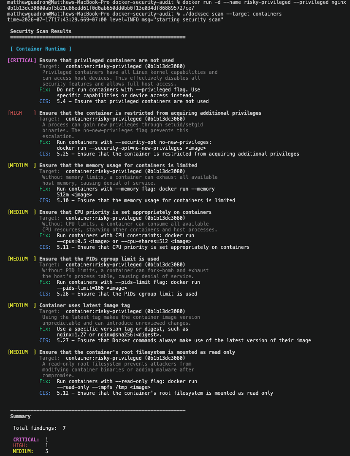
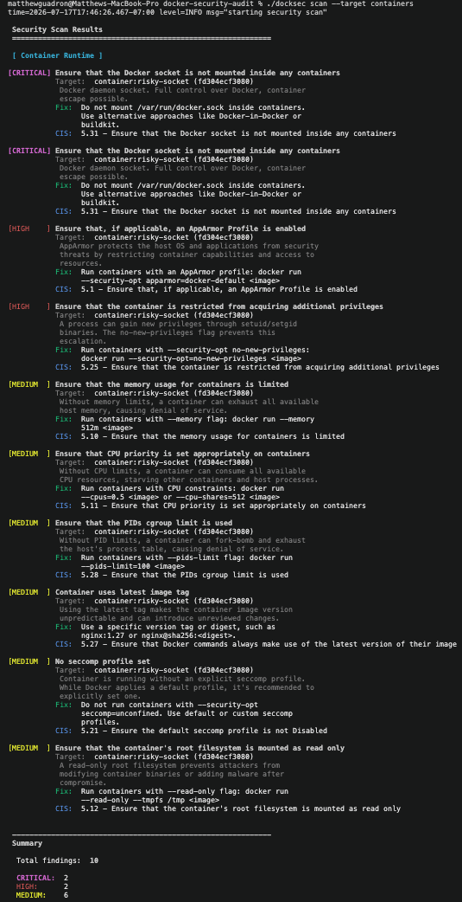
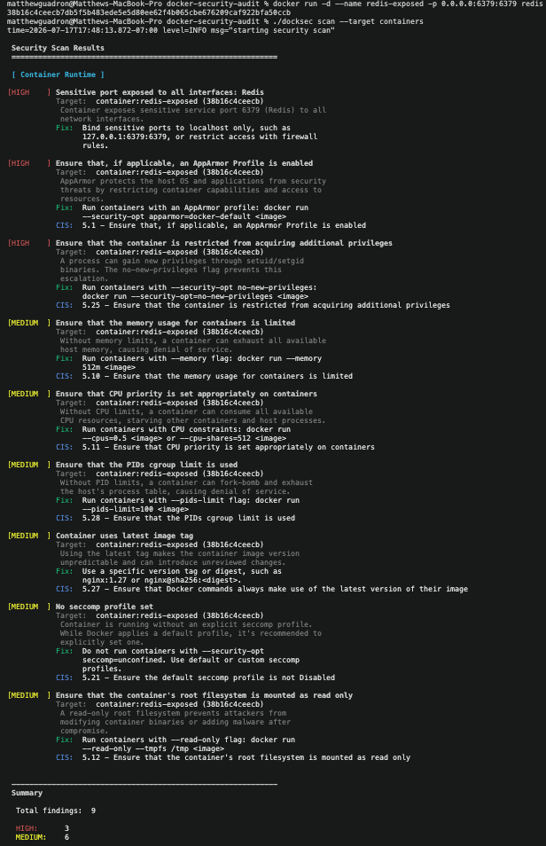
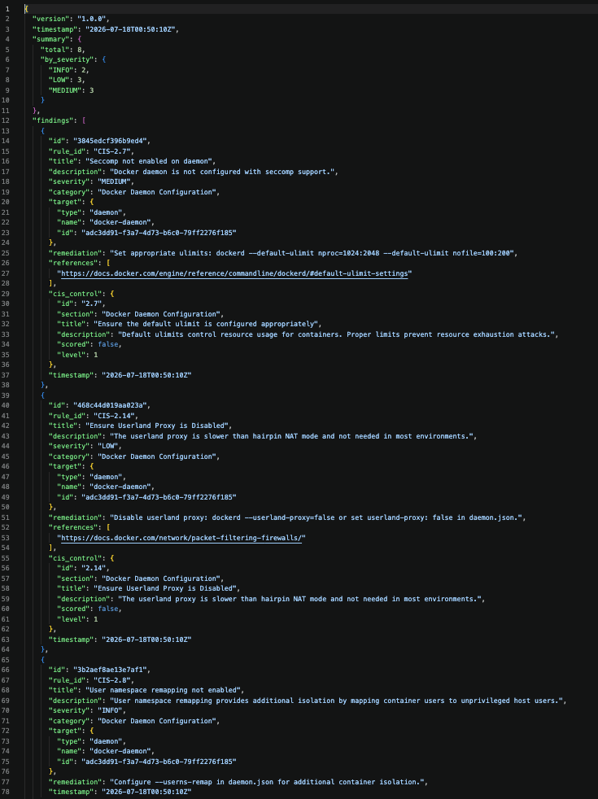
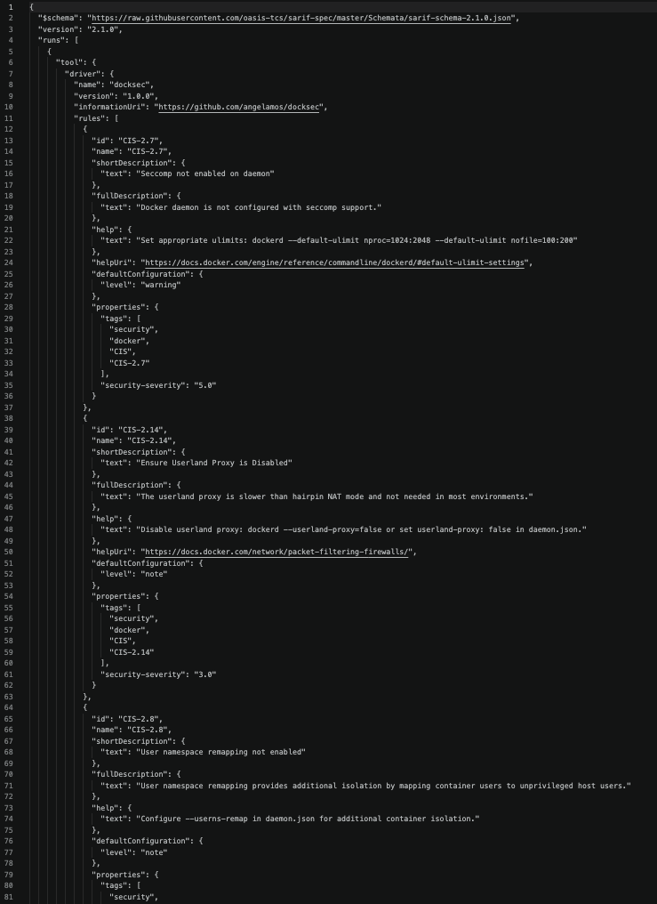
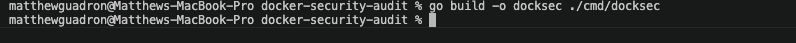
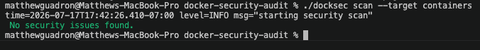

<div align="center">

# DockSec — Docker Security Audit CLI

**A Go-based container security auditing tool for identifying risky Docker configurations before they reach production.**

[](https://go.dev/)
[](https://www.docker.com/)
[](https://www.cisecurity.org/benchmark/docker)
[](LICENSE)

DockSec analyzes **running containers, Docker daemon settings, local images, Dockerfiles, and Docker Compose files** for security misconfigurations. It produces actionable findings in terminal, JSON, SARIF, or JUnit format and supports severity-based CI/CD failure thresholds.

</div>

---

## Table of Contents

- [Overview](#overview)
- [Why This Project Matters](#why-this-project-matters)
- [My Contributions](#my-contributions)
- [Core Capabilities](#core-capabilities)
- [Security Checks](#security-checks)
- [Demo](#demo)
- [Technology Stack](#technology-stack)
- [Architecture](#architecture)
- [Installation](#installation)
- [Quick Start](#quick-start)
- [Usage Examples](#usage-examples)
- [Command Reference](#command-reference)
- [Reporting and CI/CD](#reporting-and-cicd)
- [Testing](#testing)
- [Safe Demonstration Containers](#safe-demonstration-containers)
- [Project Structure](#project-structure)
- [Security Test Data Notice](#security-test-data-notice)
- [Limitations](#limitations)
- [Future Improvements](#future-improvements)
- [Skills Demonstrated](#skills-demonstrated)
- [Attribution](#attribution)
- [License](#license)

---

## Overview

DockSec is a command-line security scanner built in Go that evaluates Docker environments for insecure configurations and maps findings to relevant CIS Docker Benchmark controls.

The project combines:

- **Runtime inspection** of active containers
- **Static analysis** of Dockerfiles and Docker Compose configurations
- **Docker daemon and image review**
- **Rule-based detection** of high-risk container settings
- **Structured security reporting** for automation and code-scanning workflows
- **Severity filtering and CI/CD security gates**
- **Automated unit, integration, and end-to-end testing**

The goal is to help developers, security analysts, DevOps engineers, and platform teams identify preventable container-security weaknesses earlier in the development lifecycle.

---

## Why This Project Matters

Containers are designed to isolate applications, but insecure configuration choices can weaken that isolation. A container may become a serious security risk when it:

- Runs with privileged host-level access
- Receives dangerous Linux capabilities
- Mounts the Docker daemon socket
- Exposes administrative or database ports to every network interface
- Runs as the root user
- Uses mutable image tags such as `latest`
- Stores credentials directly in configuration files
- Runs without CPU or memory limits
- Mounts sensitive host paths
- Uses weak Dockerfile or Compose practices

DockSec turns these configuration risks into clear findings that can be reviewed manually or consumed by automated security workflows.

---

## My Contributions

This repository is a standalone portfolio version of the Docker security audit project. My work focused on extending, validating, documenting, and demonstrating the scanner.

### Custom security features implemented

- Added detection for containers using the mutable `latest` image tag
- Added detection for sensitive ports published on all host interfaces
- Added checks for missing container CPU and memory limits
- Created a reusable sensitive-port rule map covering:
  - SSH — `22`
  - Telnet — `23`
  - MySQL — `3306`
  - PostgreSQL — `5432`
  - Redis — `6379`
  - MongoDB — `27017`
  - RDP — `3389`
  - VNC — `5900`

### Validation and portfolio work completed

- Built and tested intentionally vulnerable Docker containers
- Verified privileged-container detection
- Verified dangerous-capability detection
- Verified Docker socket mount detection
- Verified exposed Redis port detection
- Created insecure Dockerfile and Docker Compose demonstration files
- Generated JSON and SARIF security reports
- Resolved Go build, formatting, duplicate-method, and test issues
- Ran the full Go test suite and final build validation
- Created a screenshot-based evidence package for GitHub and resume review
- Converted the project into a standalone GitHub repository

---

## Core Capabilities

| Capability | Description |
|---|---|
| Container scanning | Inspects running containers through the Docker API |
| Daemon scanning | Reviews Docker daemon configuration and security posture |
| Image scanning | Evaluates local Docker image configuration and metadata |
| Dockerfile analysis | Parses Dockerfiles for insecure build and runtime instructions |
| Compose analysis | Reviews Docker Compose YAML for dangerous service settings |
| CIS mapping | Associates findings with CIS Docker Benchmark controls |
| Severity filtering | Filters findings by `info`, `low`, `medium`, `high`, or `critical` |
| Container filtering | Includes or excludes containers by name pattern |
| Structured output | Supports terminal, JSON, SARIF, and JUnit output |
| CI/CD enforcement | Returns a failing exit code when findings meet a configured threshold |
| Concurrent scanning | Supports configurable worker concurrency |
| Benchmark reference | Lists and displays registered CIS control information |

---

## Security Checks

The scanner is designed to detect security weaknesses across multiple Docker layers.

### Runtime container checks

| Check | Security concern |
|---|---|
| Privileged containers | Grants broad Linux capabilities and device access |
| Dangerous capabilities | Capabilities such as `SYS_ADMIN` can provide excessive system-level power |
| Docker socket mounts | May allow a container to control Docker on the host |
| Sensitive host mounts | Can expose host files, credentials, or operating-system resources |
| Exposed sensitive ports | Database and remote-management services may become network-accessible |
| `latest` image tags | Mutable tags reduce build reproducibility and version control |
| Missing resource limits | Unbounded CPU or memory use can cause denial-of-service conditions |
| Root execution | A compromised process has greater authority inside the container |
| Weak isolation settings | Host namespace or device access can reduce container boundaries |

### Dockerfile checks

Examples of insecure patterns evaluated by the Dockerfile analyzer include:

- `USER root` or failure to use a non-root user
- Hardcoded credentials, API keys, passwords, or tokens
- Mutable `latest` image tags
- Unsafe shell patterns
- Weak package-management practices
- Risky `ADD` usage
- Missing `HEALTHCHECK`
- Configuration choices that reduce image reproducibility or runtime security

### Docker Compose checks

Examples of risky Compose settings include:

- `privileged: true`
- Docker socket mounts
- Sensitive host path mounts
- Services bound to `0.0.0.0`
- Sensitive ports published to the host
- Hardcoded secrets in environment variables
- Images using `latest`
- Missing resource restrictions
- Other service-level isolation weaknesses

### Daemon and image checks

DockSec also contains analyzers for:

- Docker daemon configuration
- Local Docker image metadata and settings
- CIS Docker Benchmark-related daemon, image, and container controls

---

## Demo

The `demo/` directory contains intentionally insecure configurations, generated reports, and screenshots that demonstrate the scanner's behavior.

### Privileged container detection

<p align="center">
  
</p>

### Docker socket mount detection

<p align="center">
  
</p>

### Exposed Redis port detection

<p align="center">
  
</p>

### Machine-readable reporting

<p align="center">
  
  
</p>

<details>
<summary><strong>Additional screenshots</strong></summary>

<br>

**Successful Go build**



**Normal container scan**



</details>

---

## Technology Stack

| Technology | Purpose |
|---|---|
| Go | Core application, analyzers, concurrency, testing, and CLI |
| Docker Engine / Docker Desktop | Runtime environment and Docker API |
| Docker Go SDK | Programmatic inspection of containers, images, and daemon settings |
| Cobra | Command-line interface and flag management |
| YAML v3 | Docker Compose parsing |
| BuildKit libraries | Dockerfile and build-related analysis |
| Testify | Go testing and assertions |
| JSON | General-purpose machine-readable reporting |
| SARIF | Security and static-analysis reporting |
| JUnit XML | CI-compatible test-style reporting |
| CIS Docker Benchmark | Security-control mapping and remediation context |

The Go version and dependency versions are defined in [`go.mod`](go.mod).

---

## Architecture

DockSec uses a modular security-scanning pipeline:

```text
User command
    │
    ▼
Cobra CLI
cmd/docksec/main.go
    │
    ▼
Configuration layer
internal/config
    │
    ▼
Scanner orchestrator
internal/scanner
    │
    ├── Runtime container analyzer
    ├── Docker daemon analyzer
    ├── Local image analyzer
    ├── Dockerfile analyzer
    └── Docker Compose analyzer
    │
    ▼
Normalized security findings
internal/finding
    │
    ▼
CIS control mapping + remediation
internal/benchmark
    │
    ▼
Terminal / JSON / SARIF / JUnit reporters
internal/report
```

### Design principles

- **Modularity:** Each Docker target has a dedicated analyzer.
- **Extensibility:** New rules can be added through the `internal/rules` and analyzer packages.
- **Normalized findings:** Results share a consistent severity and reporting structure.
- **Automation readiness:** Output formats and exit codes support security pipelines.
- **Controlled concurrency:** Worker settings allow parallelized scanning.
- **Graceful shutdown:** Signal-aware execution handles interruption safely.

---

## Installation

### Prerequisites

- Git
- Go version compatible with [`go.mod`](go.mod)
- Docker Engine or Docker Desktop
- Access to the Docker daemon for runtime scans

### Clone the repository

```bash
git clone https://github.com/MatthewGuadron/Docker-security-audit.git
cd Docker-security-audit
```

### Download dependencies

```bash
go mod download
```

### Run the test suite

```bash
go test ./...
```

### Build the CLI

```bash
go build -o docksec ./cmd/docksec
```

On Windows:

```powershell
go build -o docksec.exe ./cmd/docksec
```

### Confirm the build

```bash
./docksec --help
./docksec version
```

---

## Quick Start

Make sure Docker Desktop or the Docker daemon is running.

### Scan the complete Docker environment

```bash
./docksec scan
```

### Scan running containers

```bash
./docksec scan --target containers
```

### Scan daemon configuration

```bash
./docksec scan --target daemon
```

### Scan local images

```bash
./docksec scan --target images
```

### Scan an insecure Dockerfile

```bash
./docksec scan --file demo/Dockerfile.insecure
```

### Scan an insecure Docker Compose file

```bash
./docksec scan --file demo/docker-compose.insecure.yml
```

---

## Usage Examples

### Scan multiple targets

```bash
./docksec scan --target containers,daemon,images
```

### Scan multiple configuration files

```bash
./docksec scan \
  --file demo/Dockerfile.insecure \
  --file demo/docker-compose.insecure.yml
```

### Filter by severity

```bash
./docksec scan --target containers --severity high,critical
```

### Filter by CIS control

```bash
./docksec scan --target containers --cis 5.4,5.31
```

### Include specific containers

```bash
./docksec scan --target containers --include-container "production-*"
```

### Exclude containers

```bash
./docksec scan --target containers --exclude-container "test-*"
```

### Use minimal output

```bash
./docksec scan --target containers --quiet
```

### Enable verbose output

```bash
./docksec scan --target containers --verbose
```

### Configure worker concurrency

```bash
./docksec scan --target images --workers 8
```

### Fail a CI/CD job on medium-or-higher findings

```bash
./docksec scan --file Dockerfile --fail-on medium
```

### Display CIS benchmark controls

```bash
./docksec benchmark list
```

```bash
./docksec benchmark show 5.4
```

---

## Command Reference

### Main commands

| Command | Purpose |
|---|---|
| `docksec scan` | Scans Docker targets and configuration files |
| `docksec version` | Displays version, commit, and build information |
| `docksec benchmark list` | Lists registered CIS Docker Benchmark controls |
| `docksec benchmark show <id>` | Shows details and remediation for a CIS control |

### Scan flags

| Flag | Short | Description |
|---|---:|---|
| `--target` | `-t` | Targets: `all`, `containers`, `daemon`, `images` |
| `--file` | `-f` | Dockerfile or Docker Compose file to scan |
| `--output` | `-o` | Format: `terminal`, `json`, `sarif`, `junit` |
| `--output-file` | — | Writes results to a file |
| `--severity` | — | Filters by severity |
| `--cis` | — | Filters by CIS control ID |
| `--exclude-container` | — | Excludes containers by name pattern |
| `--include-container` | — | Includes only matching containers |
| `--fail-on` | — | Exits with code `1` at or above a severity threshold |
| `--quiet` | `-q` | Displays minimal count-based output |
| `--verbose` | `-v` | Enables detailed debugging output |
| `--workers` | — | Sets concurrent worker count |

Run the built-in help for the authoritative command reference:

```bash
./docksec scan --help
```

---

## Reporting and CI/CD

DockSec separates scan execution from report formatting, allowing the same findings to be consumed by people, scripts, dashboards, and security platforms.

### Terminal output

```bash
./docksec scan --target containers
```

Best for:

- Local testing
- Interactive investigation
- Development troubleshooting

### JSON report

```bash
./docksec scan \
  --file demo/Dockerfile.insecure \
  --output json \
  --output-file demo/results.json
```

Best for:

- Custom automation
- Data processing
- Dashboards
- Security orchestration
- Integration with internal tooling

### SARIF report

```bash
./docksec scan \
  --file demo/Dockerfile.insecure \
  --output sarif \
  --output-file demo/results.sarif
```

Best for:

- Static-analysis ecosystems
- Code-scanning workflows
- Security finding ingestion
- Standardized vulnerability reporting

### JUnit report

```bash
./docksec scan \
  --file demo/Dockerfile.insecure \
  --output junit \
  --output-file demo/results.xml
```

Best for:

- CI test-report interfaces
- Build dashboards
- Pipeline result visualization

### Severity-based pipeline gate

```bash
./docksec scan --file Dockerfile --fail-on high
```

This supports a policy such as:

> Allow informational, low, and medium findings, but fail the build when a high or critical issue is detected.

### Example GitHub Actions workflow

```yaml
name: Docker Security Audit

on:
  push:
  pull_request:

jobs:
  docksec:
    runs-on: ubuntu-latest

    steps:
      - name: Check out repository
        uses: actions/checkout@v4

      - name: Set up Go
        uses: actions/setup-go@v5
        with:
          go-version-file: go.mod

      - name: Run tests
        run: go test ./...

      - name: Build DockSec
        run: go build -o docksec ./cmd/docksec

      - name: Scan Dockerfile
        run: |
          ./docksec scan \
            --file Dockerfile \
            --output sarif \
            --output-file results.sarif \
            --fail-on high
```

---

## Testing

The repository includes:

- Unit tests
- Analyzer tests
- Integration tests
- End-to-end tests
- Purpose-built insecure Dockerfiles
- Purpose-built insecure Compose files
- Runtime demonstration containers

### Run all tests

```bash
go test ./...
```

### Run tests with verbose output

```bash
go test -v ./...
```

### Run tests with race detection

```bash
go test -race ./...
```

### Run a specific package

```bash
go test -v ./internal/analyzer
```

### Format the code

```bash
gofmt -w ./cmd ./internal ./tests
```

### Final validation sequence

```bash
go test ./...
go build -o docksec ./cmd/docksec
./docksec scan --target containers
```

A successful test run shows `ok` for tested packages and may show `[no test files]` for packages without standalone test files.

---

## Safe Demonstration Containers

> [!CAUTION]
> The commands below intentionally create insecure containers. Use them only in a controlled local environment, take the screenshot or verify the finding, and remove each container immediately afterward.

### Privileged container

```bash
docker run -d --name risky-privileged --privileged nginx
./docksec scan --target containers
docker rm -f risky-privileged
```

Expected category:

```text
Privileged container
```

### Dangerous Linux capability

```bash
docker run -d --name risky-cap --cap-add=SYS_ADMIN nginx
./docksec scan --target containers
docker rm -f risky-cap
```

Expected category:

```text
Dangerous capability
```

### Docker socket mount

```bash
docker run -d --name risky-socket \
  -v /var/run/docker.sock:/var/run/docker.sock \
  nginx

./docksec scan --target containers
docker rm -f risky-socket
```

Expected category:

```text
Docker socket mounted
```

### Exposed Redis port

```bash
docker run -d \
  --name redis-exposed \
  -p 0.0.0.0:6379:6379 \
  redis

./docksec scan --target containers
docker rm -f redis-exposed
```

Expected category:

```text
Sensitive Redis port exposed
```

### Mutable `latest` tag

```bash
docker run -d --name latest-test nginx:latest
./docksec scan --target containers
docker rm -f latest-test
```

Expected category:

```text
Container uses latest image tag
```

---

## Project Structure

```text
Docker-security-audit/
├── cmd/
│   └── docksec/
│       └── main.go              # CLI entry point
├── demo/
│   ├── Dockerfile.insecure      # Intentionally insecure Dockerfile
│   ├── docker-compose.insecure.yml
│   ├── results.json             # Example JSON report
│   ├── results.sarif            # Example SARIF report
│   └── screenshots/             # Build, findings, and report evidence
├── internal/
│   ├── analyzer/                # Container, daemon, image, file analyzers
│   ├── benchmark/               # CIS control definitions and lookups
│   ├── config/                  # CLI and scanner configuration
│   ├── docker/                  # Docker client integration
│   ├── finding/                 # Finding models and severity handling
│   ├── parser/                  # Dockerfile and Compose parsing
│   ├── proc/                    # Process and host-related helpers
│   ├── report/                  # Terminal, JSON, SARIF, and JUnit output
│   ├── rules/                   # Capabilities, paths, ports, and secret rules
│   └── scanner/                 # Scan orchestration
├── learn/                       # Project learning and reference material
├── tests/
│   ├── e2e/                     # End-to-end tests
│   ├── integration/             # Integration tests
│   └── testdata/                # Purpose-built secure/insecure fixtures
├── Dockerfile
├── go.mod
├── go.sum
├── justfile
├── LICENSE
└── README.md
```

---

## Security Test Data Notice

The files under `tests/testdata/` intentionally contain **synthetic credential patterns** and insecure settings so the secret-detection and configuration-analysis rules can be tested.

Examples include:

```text
tests/testdata/compose/bad-secrets.yml
tests/testdata/dockerfiles/bad-secrets.Dockerfile
```

Important:

- These values are test fixtures.
- They are not active production credentials.
- They must never be replaced with real keys or tokens.
- Secret-scanning platforms may correctly flag them because they are designed to resemble credentials.
- Any push-protection exception should only be approved after confirming the value is synthetic and used exclusively for testing.

---

## Limitations

DockSec is a configuration and security-posture scanner. It is not a complete substitute for every layer of container security.

Current limitations include:

- It does not replace a dedicated CVE or package-vulnerability scanner.
- Runtime scans require access to the Docker daemon.
- Access to the Docker socket is itself highly sensitive and should be tightly controlled.
- Findings identify risky configurations but may require environment-specific validation.
- Some controls may not apply to every operating system, orchestration platform, or business context.
- The scanner does not currently replace Kubernetes admission controls, cloud posture management, runtime behavioral monitoring, or image-signing verification.
- Demonstration files are intentionally insecure and should not be deployed to production.

A mature container-security program should combine DockSec-style configuration review with image vulnerability scanning, least privilege, secrets management, signed artifacts, network controls, monitoring, and policy enforcement.

---

## Future Improvements

Potential enhancements include:

- GitHub Actions workflow included directly in the repository
- Automated SARIF upload into GitHub code scanning
- Additional CIS Docker Benchmark controls
- Suppression and allowlist configuration
- Baseline comparison between scans
- HTML reporting
- SBOM generation and ingestion
- Integration with image vulnerability scanners
- Docker context and remote-daemon support
- Remediation autofix suggestions
- Configuration policy files
- Improved Windows-container coverage
- Release binaries for macOS, Linux, and Windows
- Signed release artifacts and checksums
- Performance benchmarks for large Docker environments
- Expanded unit tests for custom detection rules

---

## Skills Demonstrated

This project demonstrates practical experience with:

### Security engineering

- Container security
- Docker hardening
- CIS benchmark interpretation
- Least-privilege analysis
- Attack-surface reduction
- Secret detection
- Security finding prioritization
- Remediation guidance
- Secure configuration review

### Software engineering

- Go application development
- CLI design with Cobra
- Docker SDK integration
- YAML and Dockerfile parsing
- Modular architecture
- Concurrent scanning
- Error handling
- Automated testing
- Git version control
- Technical documentation

### DevSecOps and automation

- Security-as-code
- CI/CD quality gates
- JSON and SARIF reporting
- JUnit-compatible output
- Reproducible test environments
- Automated policy checks
- Machine-readable security results

---

## Attribution

This standalone repository is based on and extends an existing DockSec codebase. Original source structure, copyright notices, module references, and licensing information are preserved in the repository.

My portfolio contributions are documented in the [My Contributions](#my-contributions) section and focus on custom detection logic, testing, debugging, reporting, demonstration evidence, and project documentation.

Upstream project source:

- [CarterPerez-dev/Cybersecurity-Projects — Docker Security Audit](https://github.com/CarterPerez-dev/Cybersecurity-Projects/tree/main/PROJECTS/intermediate/docker-security-audit)

This attribution is included to clearly distinguish the original project foundation from the enhancements and validation work completed in this repository.

---

## License

This project is licensed under the **GNU Affero General Public License v3.0**.

See [`LICENSE`](LICENSE) for the complete license text.

---

<div align="center">

### Built to demonstrate practical container security, Go development, and DevSecOps automation.

**Repository:** [github.com/MatthewGuadron/Docker-security-audit](https://github.com/MatthewGuadron/Docker-security-audit)

</div>
